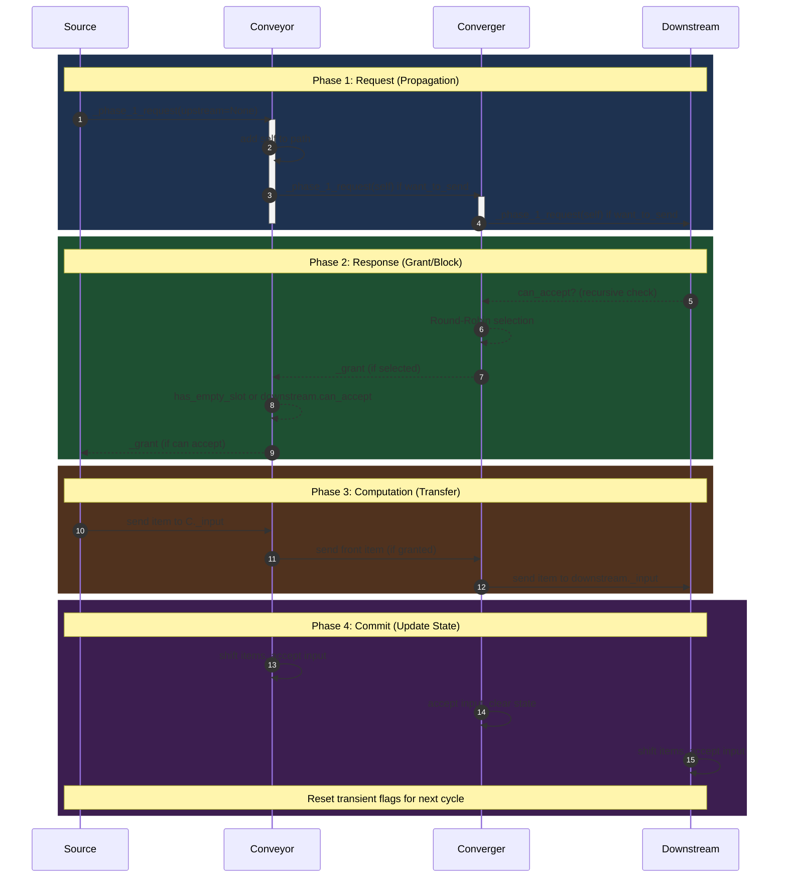

```mermaid
sequenceDiagram
    autonumber
    participant S as Source
    participant C as Conveyor
    participant CG as Converger
    participant D as Downstream

    rect rgb(30, 50, 80)
        note over S, D: Phase 1: Request (Propagation)
        S->>C: _phase_1_request(upstream=None)
        activate C
        C->>C: add self to path
        C->>CG: _phase_1_request(self) if want_to_send
        activate CG
        CG->>D: _phase_1_request(self) if want_to_send
        deactivate CG
        deactivate C
    end

    rect rgb(30, 80, 50)
        note over S, D: Phase 2: Response (Grant/Block)
        D-->>CG: can_accept? (recursive check)
        CG-->>CG: Round-Robin selection
        CG-->>C: _grant (if selected)
        C-->>C: has_empty_slot or downstream.can_accept
        C-->>S: _grant (if can accept)
    end

    rect rgb(80, 50, 30)
        note over S, D: Phase 3: Computation (Transfer)
        S->>C: send item to C._input
        C->>CG: send front item (if granted)
        CG->>D: send item to downstream._input
    end

    rect rgb(60, 30, 80)
        note over S, D: Phase 4: Commit (Update State)
        C->>C: shift items, accept input
        CG->>CG: accept input, clear state
        D->>D: shift items, accept input
        note over S, D: Reset transient flags for next cycle
    end
```
