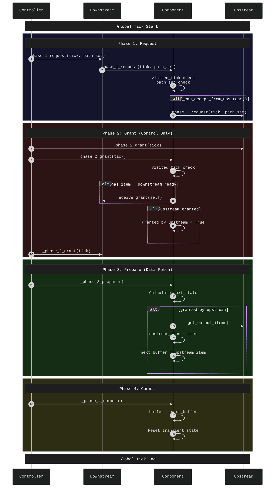

```mermaid
%%{init: {'theme': 'dark', 'themeVariables': { 
    'primaryColor': '#bb86fc', 
    'secondaryColor': '#03dac6', 
    'tertiaryColor': '#3700b3', 
    'fontFamily': 'monospace', 
    'noteBkgColor': '#1e1e1e', 
    'noteTextColor': '#ffffff',
    'labelBoxBkgColor': '#2d2d2d',
    'labelBoxBorderColor': '#bb86fc',
    'labelTextColor': '#ffffff',
    'loopTextColor': '#ffffff',
    'lineColor': '#03dac6'
}}}%%
sequenceDiagram
    autonumber
    participant Ctrl as Controller
    participant DS as Downstream
    participant Self as Component
    participant US as Upstream

    Note over Ctrl, US: Global Tick Start

    %% PHASE 1
    rect rgb(20, 20, 45)
    Note over Ctrl, US: Phase 1: Request
    Ctrl->>DS: _phase_1_request(tick, path_set)
    DS->>Self: _phase_1_request(tick, path_set)
    Self->>Self: visited_tick check<br/>path_set check
    alt _can_accept_from_upstream()
        Self->>US: _phase_1_request(tick, path_set)
    end
    end

    %% PHASE 2
    rect rgb(45, 20, 20)
    Note over Ctrl, US: Phase 2: Grant (Control Only)
    Ctrl->>US: _phase_2_grant(tick)
    Ctrl->>Self: _phase_2_grant(tick)
    Self->>Self: visited_tick check
    alt has item + downstream ready
        Self->>DS: _receive_grant(self)
    end
    alt upstream granted
        Self->>Self: granted_by_upstream = True
    end
    Ctrl->>DS: _phase_2_grant(tick)
    end

    %% PHASE 3
    rect rgb(20, 45, 20)
    Note over Ctrl, US: Phase 3: Prepare (Data Fetch)
    Ctrl->>Self: _phase_3_prepare()
    Self->>Self: Calculate next_state
    alt granted_by_upstream
        Self->>US: get_output_item()
        Self->>Self: upstream_item = item
        Self->>Self: next_buffer = upstream_item
    end
    end

    %% PHASE 4
    rect rgb(45, 45, 20)
    Note over Ctrl, US: Phase 4: Commit
    Ctrl->>Self: _phase_4_commit()
    Self->>Self: buffer = next_buffer
    Self->>Self: Reset transient state
    end

    Note over Ctrl, US: Global Tick End
```