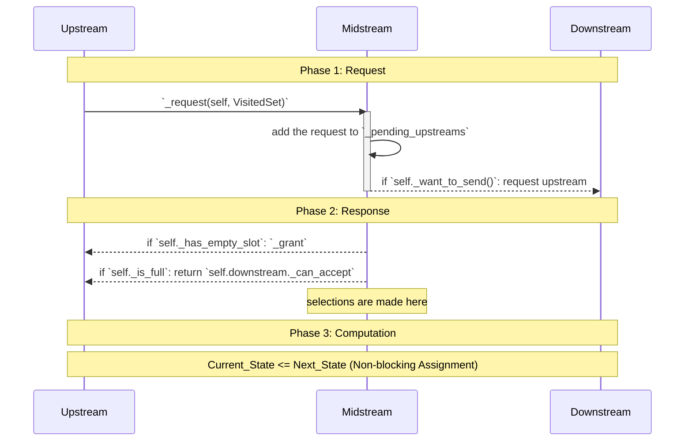

## 通信协议

```mermaid
sequenceDiagram
    participant Up as Upstream
    participant Mid as Midstream
    participant Down as Downstream

    Note over Up, Down: Phase 1: Request
    Up->>Mid: `_request(self, VisitedSet)`
    activate Mid
    Mid->>Mid: add the request to `_pending_upstreams`
    Mid-->>Down: if `self._want_to_send()`: request upstream
    deactivate Mid

    Note over Up, Down: Phase 2: Response
    Mid-->>Up: if `self._has_empty_slot`: `_grant`
    Mid-->>Up: if `self._is_full`: return `self.downstream._can_accept`
    activate Mid
    Note over Mid: selections are made here    
    
    Note over Up, Down: Phase 3: Computation
    

    Note over Up, Down: Current_State <= Next_State (Non-blocking Assignment)
```
