```mermaid
sequenceDiagram
    autonumber
    participant U as Upstream
    participant C as Current
    participant D as Downstream

    rect rgb(30, 50, 80)
        note over U,D: Phase 1: Request Propagation
        U->>C: request (if U wants to send)
        activate C
        C->>C: record upstream
        C->>D: request (if C wants to send)
        activate D
        D->>D: record upstream
        deactivate D
        deactivate C
    end

    rect rgb(30, 80, 50)
        note over U,D: Phase 2: Adjudication (Optional)
        C->>C: select upstream (e.g., Round-Robin)
    end

    rect rgb(80, 50, 30)
        note over U,D: Phase 3: Grant Response
        D->>D: can accept?
        D->>C: grant (if accepted)
        C->>C: can accept? (check self or recurse)
        C->>U: grant (if can accept)
    end

    rect rgb(60, 30, 80)
        note over U,D: Phase 4: Item Transfer
        U->>C: send item
        C->>D: send item (if D granted)
    end

    rect rgb(50, 50, 50)
        note over U,D: Phase 5: Commit & Reset
        U->>U: update state
        C->>C: shift items, accept input, reset flags
        D->>D: collect item, reset flags
    end
```

## 时序图



### 2026.03.06 更新

增加了“剪枝跳过”逻辑，如果前方空且当前想递送，则直接递送物品，跳过后续阶段. 遗憾的是，依然未能实现优先级. 

## 测试

```sh
uv run pytest
```

- 还未能实现分流器-汇流器直接相连时的优先级（测试失败）
- 还未测试“阻尼”现象，猜测多半无法实现（其应该和优先级有相同的诱发原因）

## Usage

```python
from simulation import *

# 建立组件列表
components = [
    ...
]

# 连接组件
# upstream.connect_to(downstream)
components[...].connect_to(...)
components[...].connect_to(...)
components[...].connect_to(...)
...

# 模拟 (方式 1)
controller = Controller(components)
for _ in range(total_ticks):
    controller.step()

# 模拟 (方式 2)
run_simulation(components, total_ticks)
```