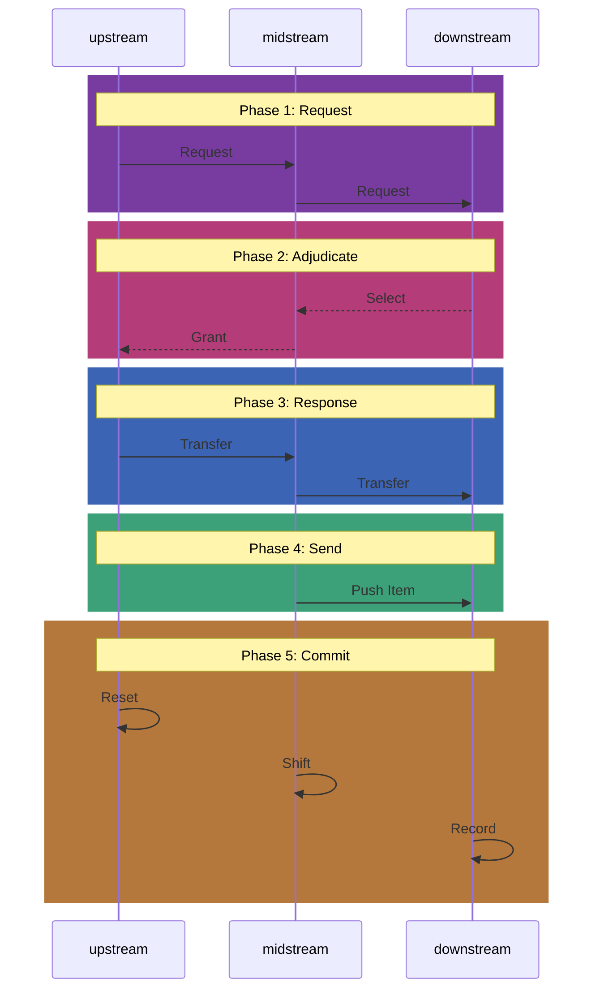

```mermaid
sequenceDiagram
    participant U as upstream
    participant M as midstream
    participant D as downstream

    rect rgb(120, 60, 160)
        note over U, D: Phase 1: Request
        U->>M: Request
        M->>D: Request
    end

    rect rgb(180, 60, 120)
        note over U, D: Phase 2: Adjudicate
        D-->>M: Select
        M-->>U: Grant
    end

    rect rgb(60, 100, 180)
        note over U, D: Phase 3: Response
        U->>M: Transfer
        M->>D: Transfer
    end

    rect rgb(60, 160, 120)
        note over U, D: Phase 4: Send
        M->>D: Push Item
    end

    rect rgb(180, 120, 60)
        note over U, D: Phase 5: Commit
        U->>U: Reset
        M->>M: Shift
        D->>D: Record
    end
```