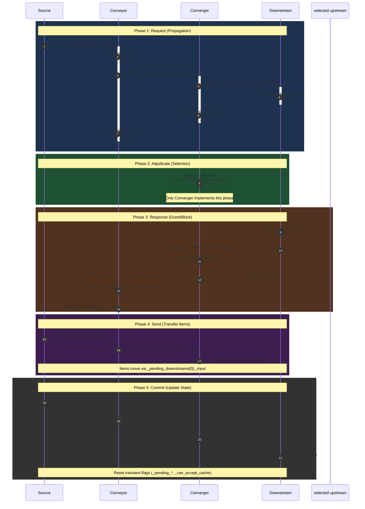

```mermaid
sequenceDiagram
    autonumber
    participant S as Source
    participant C as Conveyor
    participant CG as Converger
    participant D as Downstream

    rect rgb(30, 50, 80)
        note over S, D: Phase 1: Request (Propagation)
        S->>C: _phase_1_request(upstream=None)
        activate C
        C->>C: add self to path
        C->>CG: _phase_1_request(self) if want_to_send
        activate CG
        CG->>D: _phase_1_request(self) if want_to_send
        activate D
        D->>D: record pending upstream
        deactivate D
        CG->>CG: record pending upstream
        deactivate CG
        C->>C: record pending upstream
        deactivate C
    end

    rect rgb(30, 80, 50)
        note over S, D: Phase 2: Adjudicate (Selection)
        CG->>CG: _phase_2_adjudicate<br/>Round-Robin select upstream
        Note over CG: Only Converger implements this phase
    end

    rect rgb(80, 50, 30)
        note over S, D: Phase 3: Response (Grant/Block)
        D-->>D: _can_accept always returns true
        D-->>C: _grant (via _pending_downstreams)
        CG-->>CG: check selected_upstream
        CG-->>selected upstream: _grant if selected
        C-->>C: _can_accept (check slot or recurse downstream)
        C-->>S: _grant (if can accept)
    end

    rect rgb(60, 30, 80)
        note over S, D: Phase 4: Send (Transfer Items)
        S->>C: transfer item to C._input
        C->>CG: transfer front item to CG._input
        CG->>D: transfer item to D._input
        Note over S,D: Items move via _pending_downstreams[0]._input
    end

    rect rgb(50, 50, 50)
        note over S, D: Phase 5: Commit (Update State)
        S->>S: _phase_5_commit: prepare next item
        C->>C: _phase_5_commit: shift items, accept input
        CG->>CG: _phase_5_commit: shift items, clear selection
        D->>D: _phase_5_commit: collect received items
        Note over S,D: Reset transient flags (_pending_*, _can_accept_cache)
    end
```