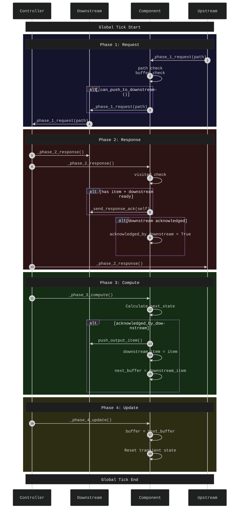

```mermaid
%%{init: {'theme': 'dark', 'themeVariables': { 
    'primaryColor': '#bb86fc', 
    'secondaryColor': '#03dac6', 
    'tertiaryColor': '#3700b3', 
    'fontFamily': 'monospace', 
    'noteBkgColor': '#1e1e1e', 
    'noteTextColor': '#ffffff',
    'labelBoxBkgColor': '#2d2d2d',
    'labelBoxBorderColor': '#bb86fc',
    'labelTextColor': '#ffffff',
    'loopTextColor': '#ffffff',
    'lineColor': '#03dac6'
}}}%%
sequenceDiagram
    autonumber
    participant Ctrl as Controller
    participant DS as Downstream
    participant Self as Component
    participant US as Upstream

    Note over Ctrl, US: Global Tick Start

    %% PHASE 1
    rect rgb(20, 20, 45)
    Note over Ctrl, US: Phase 1: Request
    US->>Self: _phase_1_request(path)
    Self->>Self: path check<br/>buffer check
    alt _can_push_to_downstream()
        Self->>DS: _phase_1_request(path)
    end
    DS->>Ctrl: _phase_1_request(path)
    end

    %% PHASE 2
    rect rgb(45, 20, 20)
    Note over Ctrl, US: Phase 2: Response
    Ctrl->>DS: _phase_2_response()
    Ctrl->>Self: _phase_2_response()
    Self->>Self: visited check
    alt has item + downstream ready
        Self->>DS: _send_response_ack(self)
    end
    alt downstream acknowledged
        Self->>Self: acknowledged_by_downstream = True
    end
    Ctrl->>US: _phase_2_response()
    end

    %% PHASE 3
    rect rgb(20, 45, 20)
    Note over Ctrl, US: Phase 3: Compute
    Ctrl->>Self: _phase_3_compute()
    Self->>Self: Calculate next_state
    alt acknowledged_by_downstream
        Self->>DS: push_output_item()
        Self->>Self: downstream_item = item
        Self->>Self: next_buffer = downstream_item
    end
    end

    %% PHASE 4
    rect rgb(45, 45, 20)
    Note over Ctrl, US: Phase 4: Update
    Ctrl->>Self: _phase_4_update()
    Self->>Self: buffer = next_buffer
    Self->>Self: Reset transient state
    end

    Note over Ctrl, US: Global Tick End
```